# RAG Knowledge Assistant

ドキュメントをAIに読み込ませ、質問応答やタスク分析ができるナレッジアシスタントアプリ（Flutter製）

## 主な機能

- **ドキュメント管理** — PDFファイルをアップロード・管理
- **RAG チャット** — アップロードしたドキュメントを元にAIが質問に回答（参考資料付き）
- **タスク分析** — タスクをAI Agentが自動分析（サブタスク分解・時間見積もり・優先度・スケジュール作成）

## 技術スタック

| カテゴリ | 技術 |
|---------|------|
| フレームワーク | Flutter (Dart) |
| 状態管理 | Riverpod |
| ルーティング | GoRouter |
| API通信 | Dio |
| UIライブラリ | Shadcn UI |
| リアルタイム通信 | WebSocket |

## スクリーンショット

### ホーム画面

アプリ起動直後のホーム画面です。各機能への導線が表示されます。

---

### ドキュメント管理

PDFファイルをアップロードして管理できます。アップロードしたドキュメントはRAGチャットの参考資料として使われます。

  
  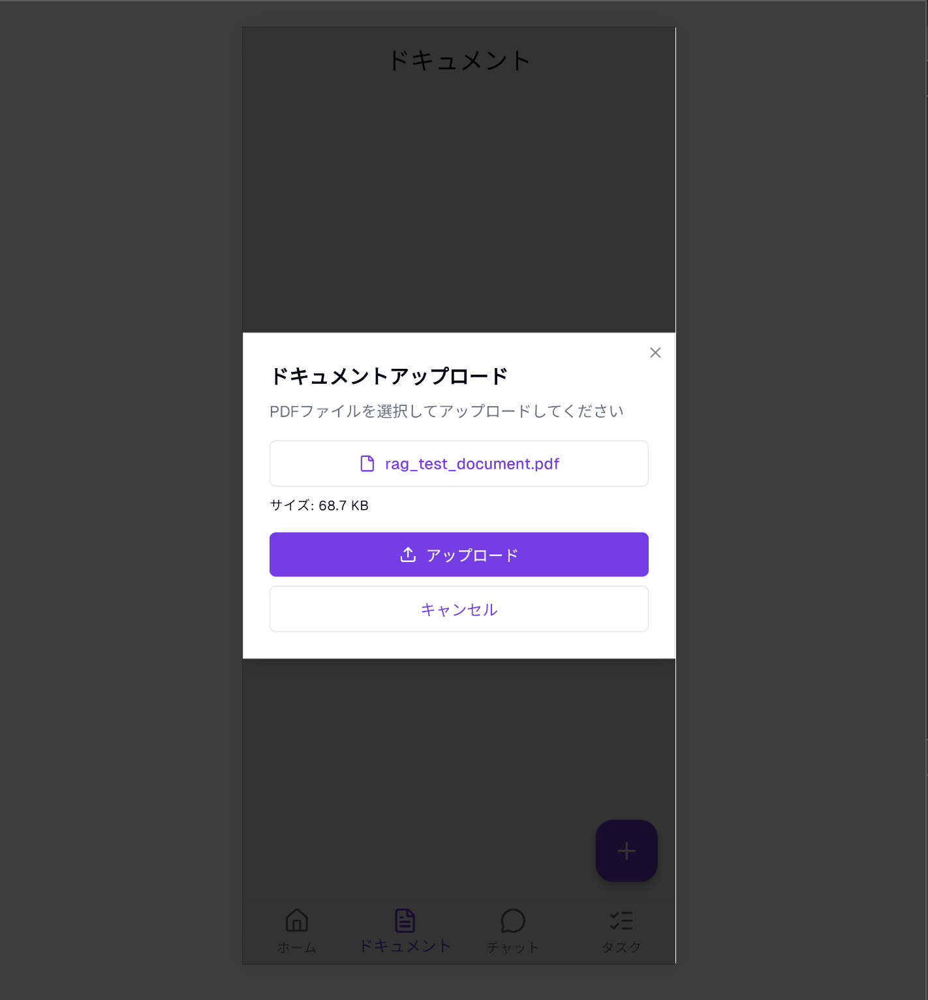
  

> 左: 初期状態 → 中央: アップロードダイアログ → 右: アップロード後の一覧

---

### RAG チャット

アップロードしたドキュメントを元に、AIが質問に回答します。回答には参考資料のリンクが付きます。

  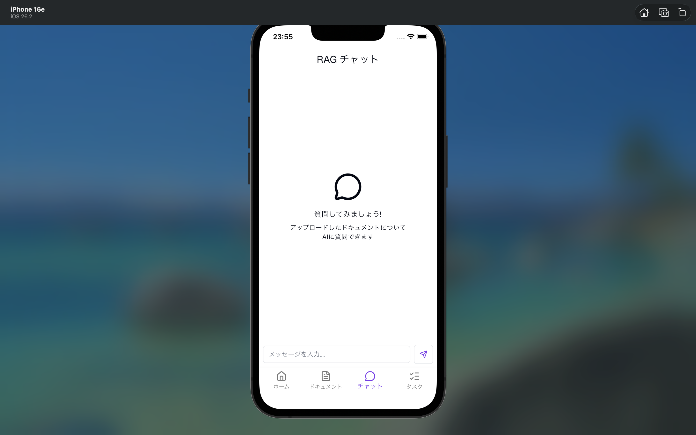
  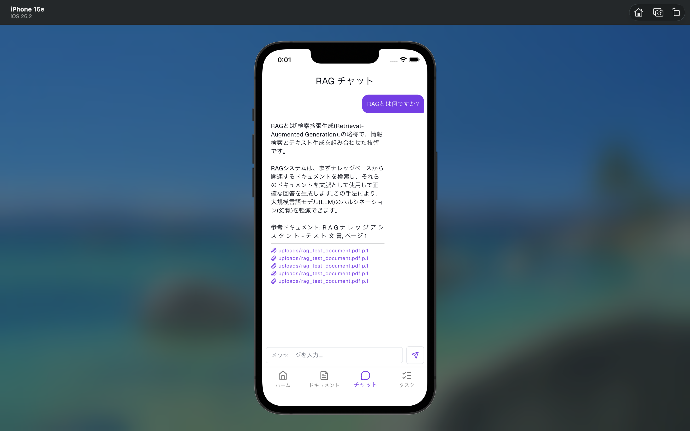

> 左: 初期状態 → 右: AIからの回答（参考資料付き）

---

### タスク管理

タスクを入力すると、AI Agentがリアルタイムで分析を行います。WebSocketによる処理状況の表示に対応しています。

  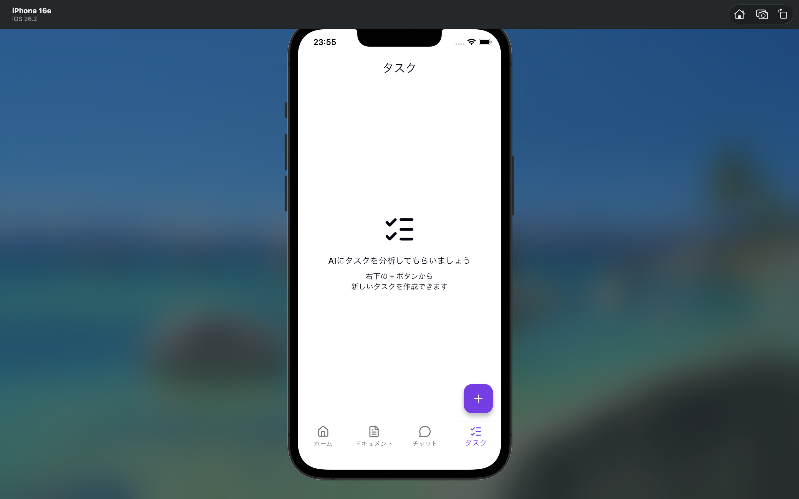
  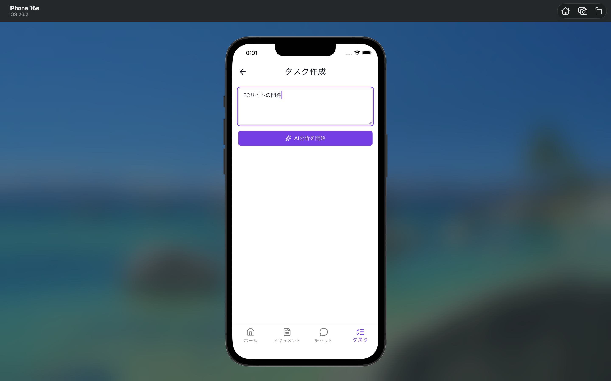
  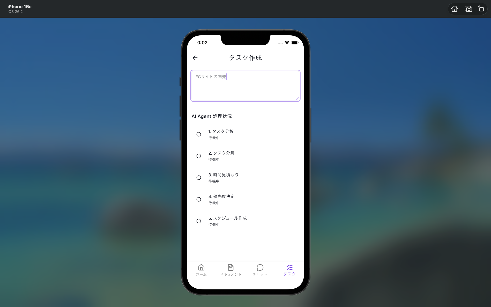
  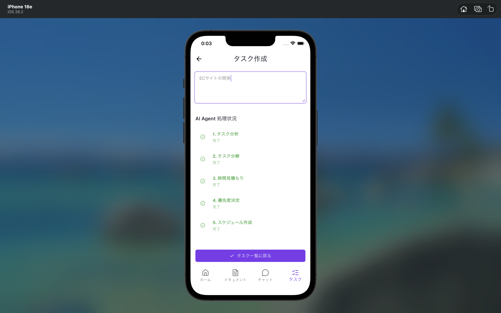

> 左から: 初期状態 → タスク入力 → AI Agent処理中 → 処理完了

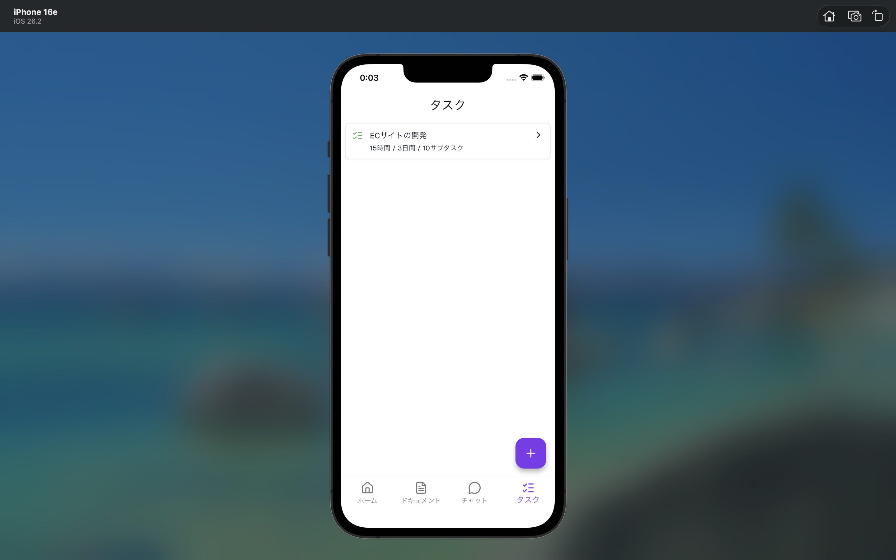

> 作成済みタスクの一覧表示

---

### タスク詳細

AI Agentが分析した結果を詳細に確認できます。分析結果・サブタスク・時間見積もり・優先度・スケジュールが表示されます。

**分析結果**

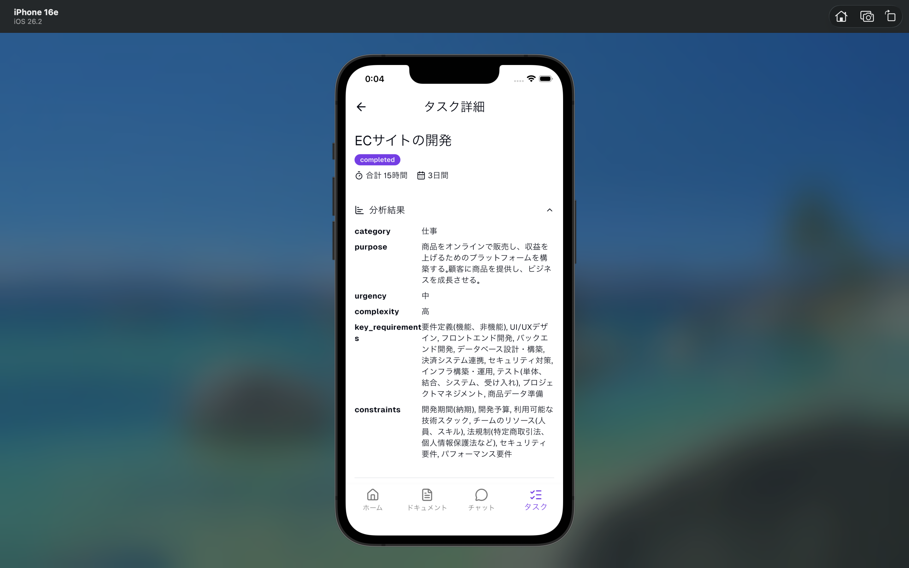

**サブタスク一覧**

  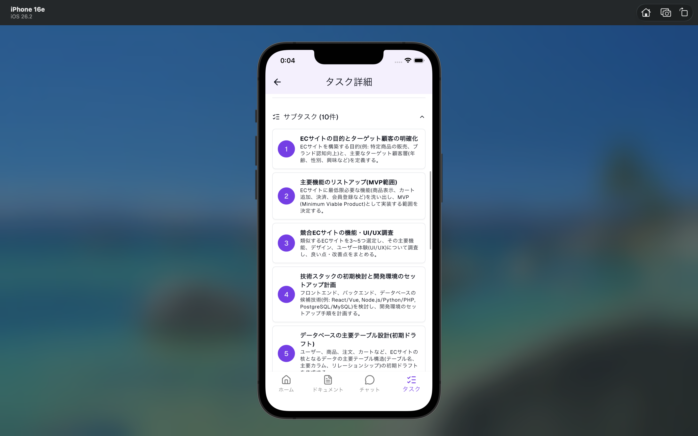
  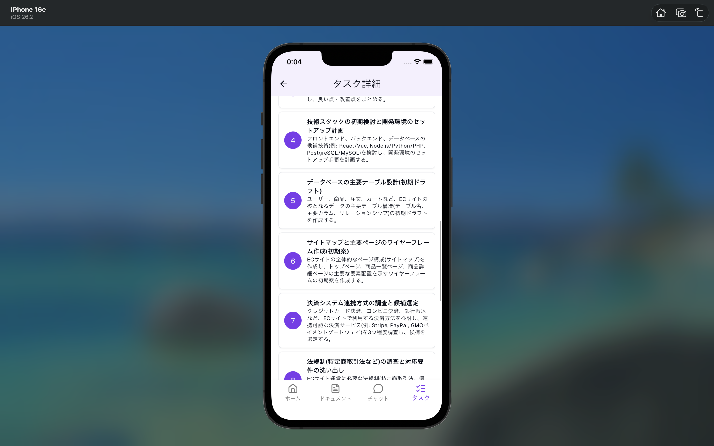

**時間見積もり**

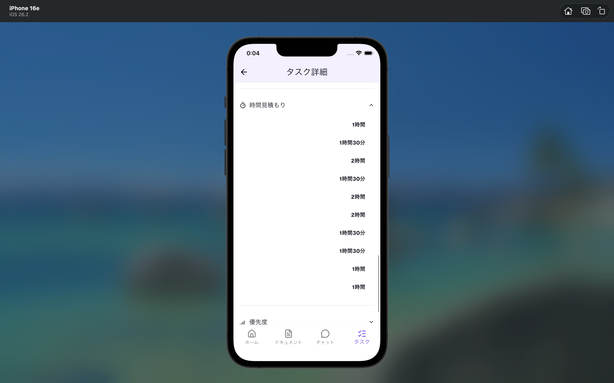

**優先度**

  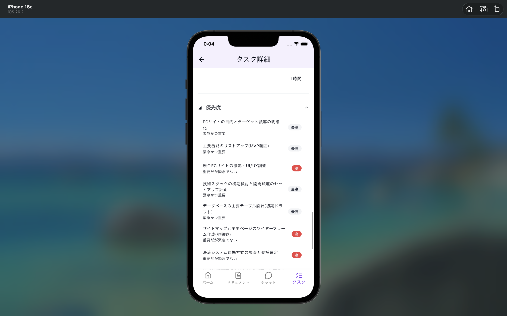
  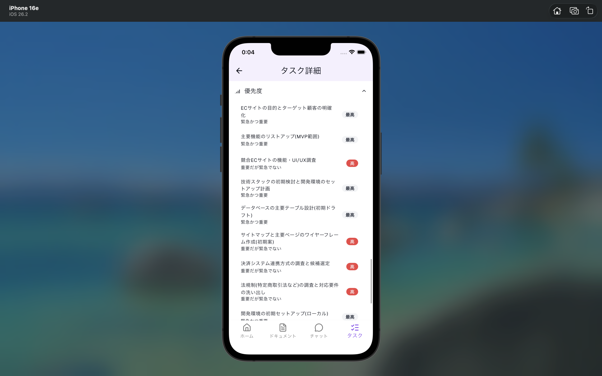

**スケジュール**

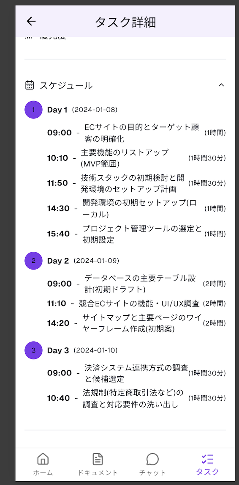
